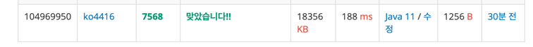

[__백준 7568번 - 덩치__](https://www.acmicpc.net/problem/7568)

**접근**
> 1. 사람의 덩치는 키, 몸무게로 표현한다.  
> 2. A의 키와 몸무게 둘다 B보다 높을 경우, A는 B보다 덩치가 좋다고 판단한다.  
> 3. 만약 A가 B보다 키는 크지만 몸무게는 적을 경우 비교 우위를 가리기 어렵다고 판단한다.  
> 4. 각 집단의 덩치 등수는 자신보다 더 큰 덩치의 사람의 수로 정해진다.  
> 5. 자신보다 큰 덩치를 가진 사람이 K명이면 자신의 등수는 K+1이다.  
> 6. 같은 덩치 등수를 가진 사람은 여러 명도 가능하다.  
> 7. 덩치 순위를 판단할 때 중요한 점은 본인 보다 덩치가 좋은 사람이 있을 때만 k가 +1이 된다는 점이다.

**문제해결**
```
> 집단의 속한 사람의 숫자를 변수 N으로 입력 받는다.
> 집단의 속한 사람들의 키와 몸무게를 받을 2차원 배열을 group를 생성한다.
> 덩치 순위를 매길 길이가 N인 rank 배열을 생성한다.
> 본인보다 덩치가 좋은 사람의 수를 담을 count 변수를 선언한다.
> 2중 for문을 사용하여 본인보다 덩치가 좋은 사람들이 있을때 count를 +1을 한다.
> 반복문이 끝나기 전 본인의 해당하는 rank 배열의 인덱스에 count+1 값을 할당한다.
```
**후기**
> 단순 반복문만 가지고 풀 수 있어서 생각보다 풀이에 난이도는 없었다.  
> 좀 더 간결하게 풀 수 있는 방법이 많아 보인다.  
> 풀이는 쉬웠지만 아직 자바 기초 부분이 탄탄하지 않은 점이 보인다.. 더 열심히 공부해야겠다.  



