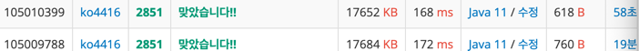

[__백준 2581번 - 슈퍼마리오__](https://www.acmicpc.net/problem/2851)

**접근**
> 1. 슈퍼마리오 앞에는 10개의 버섯이 일렬로 놓여져있다. (길이가 10인 배열)  
> 2. 모든 버섯을 먹을 필요는 없고 먹는 중간에 멈출 수 있지만 순차적으로 먹어야 한다.
> 3. 중단 이후 남은 버섯은 먹지 못한다.
> 4. 중단 전까지 먹은 버섯 점수의 합이 100에 가깝게 도달해야 한다.

**문제해결**
```
> 1. 길이가 10인 mushroom 배열을 선언하고 버섯 점수를 입력 받게 한다.  
> 2. 조건문 과 반복문 사용해 합이 100이 넘었을 때 빠져나가 100과 더 가까운 값을 출력한다.  
```
**후기**
> 처음 풀이는 할 때는 break를 걸고 Math 라이브러리를 사용해서 결과를 도출했다.  
> 분명 더 나은 코드가 있을 거 같아 구글링을 해 본 도중 변수를 많이 선언하지 않고 sum 하나로 처리하는 코드를 봐서 리팩토링을 해보았다.  
> 다음에 문제풀이를 할 때는 해결 방법을 더 세분화하고 각 해결 방법에 대한 접근법도 세분화하여 코드의 가독성을 높이는 연습을 해야겠다. 



