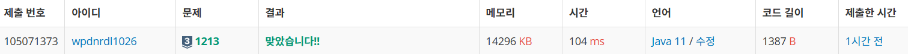

https://www.acmicpc.net/problem/1213

**접근**
> 입력받은 문자열을 이루는 문자들을 트리맵에 몇개가 있는지를 value 값으로 저장한다.
> 이때 개수가 홀수인 문자가 여러개면 대칭을 이룬다는 팰린드롬 특성상 대칭이 불가능해진다.
> 따라서 홀수개인 문자가 하나일 때만 따지고 아니라면 불가능 출력문을 낸다.
> 이제 홀수개인 문자를 팰린드롬 문자열의 중앙 값으로 미리 지정하고 개수를 -1한다.
> 이제 나머지 단어들은 전부 짝수개이므로 무조건 대칭을 이룬다.
> 트리맵 특성상 사전순 정렬되어있으므로 맵의 원소들을 차례대로 반복문으로 접근하며 2개씩 줄여나가며 팰린드롬 문자열에 기입한다.
> left, right로 문자열의 첫, 끝 인덱스를 가리키며 문자를 기입할 때마다 left를 ++, right를 --해서 전부 채운다.

**문제해결**
```
> 문자열 str을 입력받고 트리맵 alpha에 문자,정수 형태로 각 문자의 개수를 저장한다.
> 문자열의 길이가 홀수면 중앙값이 있고 짝수면 없기 때문에 두 경우 모두를 위해 center에 null값 '\0'을 준다.
> 맵의 원소를 전부 돌며 value가 홀수인 문자가 있다면 odd의 개수를 누적시키며 center에 해당 문자를 저장한다.
> 그리고 해당 문자의 개수를 -1해서 모든 문자의 개수를 짝수개로 만든다.
> 불가능한경우를 위해 앞서 누적했던 odd를 보는데 1보다 크면 불가능한 문자이므로 바로끝내준다.
> 이제 팰린드롬 문자열 배열 rst를 선언하고 중앙을 나타내는 인덱스에 앞서 저장한 중앙값을 넣는다.
> left, right로 대칭을 위한 인덱스를 시작과 끝으로 잡는다.
> 트리맵이므로 맵의 원소가 사전순으로 따져진다.
> c에 문자, cnt에 해당 문자의 개수를 미리 받아오고 cnt가 0이 될 때까지 반복한다.
> rst의 left와 right에 해당 c를 저장하고 한번 연산마다 2개 씩 빠지므로 cnt에서 2씩 감소시킨다.
> 동시에 left와 right를 각각 ++, -- 해서 인덱스를 이동해 문자열을 채울 수 있게 한다.
> 만들어진 문자열을 출력한다.
```

**후기**
> 좀 어려웠다..