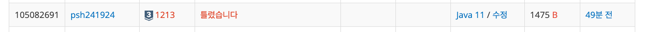
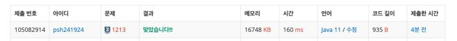

[백준 1213번 - 팰린드롬](https://www.acmicpc.net/problem/1213)

### 접근 방식

```
# method 1. 입력받은 순서대로 출력하도록

[AA,BB,CC,AA,D,BB] for문 돌리면서 두 쌍씩 찾음. 
AA중 A만 front에 저장한다. 
D는 middel에 저장한다.
front + middle + back 으로 최종 문자열값을 출력하자.
```

```
method2. 사전순으로 출력하도록 

[AAAABBBBCCD] 정렬 먼저한다.
i,i+1 의 접근에서
두 값이 같은 경우 -> i값만 front로 저장 -> 다음 순회 i+2부터
두 값이 다른 경우 -> i값만 middle로 저장 -> 다음 순회 i+1부터
```

두 방식 모두 최종 출력값을 front + middle + back의 방식으로 저장한다.
1. 입력받은 순서대로 출력하는 경우 : method1
2. 사전순으로 출력하는 경우 : method2 
를 쓰면 될 것 같다. 

이외에도 hashmap 을 활용한 풀이가 가능할 것 같다. 

---
### 예외처리

1. middle값이 없거나, 오직 한 문자만 올 수 있음.
2. 인덱스값을 접근할때 배열을 벗어나지 않도록 하자.
---

### method1. 풀이 

1. for문 돌면서 일치하면 +"A"
   [AA,B,C]
2. "AA" "BB" "AA" "c" length가 홀수인게 1개 이상이면 -> false
3. 아니면 -> true

+ 해당 값이 존재하는 지 비교할때 (A in arr) --> arr.contains(A)
+ ArrayList의 값을 덮어쓸 때 A를 AB로 --> A.set(index, A.get + B) 


입력받은 순서대로 정렬이 아니라 사전순 정렬을 출력해야하므로 틀림. 

---

### method2. 풀이
1. 알파벳을 char[]에 담아 정렬 //A,A,A,A,B,B,C,C,D,E,E
2. front, middle, back , odd,i 정의
   - back은 front의 reverse -> front를 StringBuilder로 정의
   - odd는 홀수문자를 센다. 하나 이상일 경우 false 처리
   - for문이 아닌 while문을 사용하기 때문에 i를 count한다. 
3. 반복문
    - 짝이 2개씩 맞는경우 -> front에 하나만 추가 -> i 를 2칸증가
    - 짝이 맞지 않는 경우 -> middle값으로 추가 -> i를 1칸 증가, odd를 1증가
4. 최종 문자열 : front + middle + back(front.reverse)

+ for문 돌리면 증가 i를 짝을 판별하기 어려움
+ if(c[i]==c[i+1]) 여기서 i+1이 c.length를 벗어날수도 있음


---
### 후기
문제를 잘 확인하지 못해서 출력값의 경우의 수가 여러개인 줄 알았다. 
그럴일은 없으니까 문제에서 앞으로 잘 확인해야겠다. 
