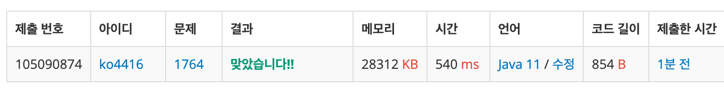

[백준 1764번 듣보잡](https://www.acmicpc.net/problem/1764)

**접근**
> 듣도 보도 못한 사람의 수와 그 명단을 사전순으로 출력하는 문제이다.  

**문제해결**
```
> 입력을 보니 첫째 줄에 듣도 못한 사람수 N, 보도 못한 사람의 수 M이 주어진다.  
> 출력은 사전순으로, 듣도 보도 못한 사람을 출력한다.  
> 각 명단에는 중복이 없다고 조건이 있다. 결국 중복이 있으면 그 사람은 듣고 보도 못한 사람이라 출력하면 된다.  
> 사전순으로 출력이니 TreeMap을 생성하고 찾는 키(이름)이 없으면 1, 만약 있다면 현재 값 +1, 결국 value가 2인 키를 찾으면 된다.  
> 입력 받는 for문 안에서 value가 2인 키가 생길 때마다 total를 증감연산자를 사용해 더해줬다.
> 그리고 조건에 맞는 값으 출력했다.  
```
**후기**
> 생각보다 쉬웠다,, 처음에는 HashMap을 두개 쓸까 생각도 해봤는데, 좀 더 조건을 보고 고민을 해보니 위처럼 문제 접근이 되어 편하게 풀었다.

