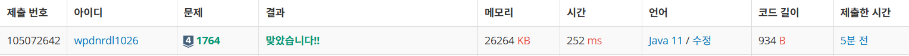

https://www.acmicpc.net/problem/1764

**접근**
> 못들어본애, 못본애 중에 겹치는애를 찾으면 되므로 Set을 통해 둘 중 아무애를 저장한다.
> 이제 다른 애를 입력받으며 Set의 저장된 애중에 겹치는 애가 있는지 contains로 본다.
> 있다면 따로 결과 배열에 저장한 뒤 정렬해서 인원수와 이름을 출력한다.

**문제해결**
```
> N과 M으로 못들어본 애, 못본 애의 수를 받는다.
> Set을 선언하고 N명을 입력받아 N_listen에 저장한다.
> 이제 M명을 입력받으며 contains를 이용해 N_listen에 있는지 확인한다.
> 있다면 동적 배열 rst에 이름을 저장한다.
> 사전 순 출력을 위해 정렬해주고 인원수와 이름을 출력한다.
```

**후기**
> c++로는 해봤는데 자바로는 처음이었다. 어떻게 하면 더 조금 연산할까 고민을 더 해봤다.