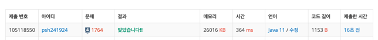

[백준 1764번 - 듣보잡](https://www.acmicpc.net/problem/1764)

### 접근 방식

```
자료구조는 treemap : 이름키기준으로 자동정렬
1. 듣도못한 사람을 key값으로 이름을 저장한다.
2. 보도못한 사람이 기존에 저장된 key값과 일치하다면 value++
3. value값이 2개면 -> 듣도+보도 못한 사람이다. 

```
### method. 풀이

1. buffer로 입력받기
    - StringTokenizer 객체 생성, (공백으로 입력값 구분)
    - st.nextToken 으로 같은 줄에 입력받은 숫자를 가져오기
    - String name = br.readLine() 을 n 반복문에 넣어 입력값 받아오기
2. TreeMap 객체 생성
3. 듣도못한 사람을 먼저 저장한다. 이름을 key값으로 저장하고 value는 1로 카운트
4. 보도못한 사람의 이름이 map에 key값으로 존재한다면 ,value값은 2가 된다. 
5. map을 순회하며 value값이 2인 key를 찾아 arraylist에 담는다.
6. arraylist -> 듣도보도못한 사람이 담긴다.



---
### 후기