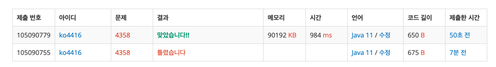

[백준 4358번 생태학](https://www.acmicpc.net/problem/4358)

**접근**
> 한 줄당 하나의 나무 종의 이름을 입력 받는다.  
> 각 나무들의 분포비율과 이름을 사전순으로 출력한다.  

**문제해결**
```
> EOF처리는 나무 이름을 받을 String 변수를 선언하여 while 문의 조건식을 입력이 null일때 결과문을 출력하게 설정했다.
> TreeMap은 저장과 동시 사전순으로 정렬해주기 때문에 사용했고 total은 어차피 4째자리까지만 출력하면 되니 좀 더 크기가 작은 float로 해줬는데 나중에 종이 많아지면 오차 범위가 발생한다고 한다. 
> 나무의 이름을 입력 받고, 받을 때마다 전체 나무 개수를 증감연산자로 더해줬다.  
> 각 나무의 개수는 getOrDefault 메소드를 사용하여 찾는 키가 없으면 0 + 1, 있으면 현재 값 + 1을 해줬다.  
> 출력은 향상된 for문으로 돌면서 출력했다.
```
**후기**
> total을 자료형 크기를 고려해 4째자리까지 반올림이여서 float로 했다.  
> 코드 피드백을 달라고 제미나이 돌려보니 입력 받는 데이터가 커질수록 오차가 생길수도 있다고 했다.  
> float나 double 둘 중 하나로 받아도 수백만개의 배열을 만드는 게 아닌거면 차이가 거의 없어 출력 결과의 정확성을 보장하기 위해 double 쓰는 게 맞다고 했다.  
> 처음에는 HashMap으로 데이터를 집어넣고 TreeMap으로 변환하려 했는데 TreeMap 자체 기능이 사전순 정렬이라는 걸 알았다,, 원래 메소드를 써서 정렬하는 거라고 알고 있어서 HashMap으로 받고 변환하려 했는데 아니였다...
> 첫 풀이에 틀린것은 total을 입력 받을 때마다 해당 키의 값으로 더해버렸다.  

