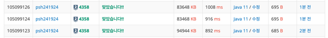

[백준 4358번 - 생태학](https://www.acmicpc.net/problem/4358)

### 접근 방식

```
1. 중복된 key을 세야하고 자동으로 정렬처리 -> TreeMap
2. value값과 total 값을 이용해서 백분율을 구해야함. 
3. 입력을 반복문을 통해 입력받으면서 총 입력갯수를 count해줘야함. 
```

---
### 예외처리
```
if(input == null || input.isEmpty()) break;
입력받는 반복문 안에서 input값이 null이 될때 break하도록,
intelliJ에서는 null을 인식잘 못하는거 같아서 isEmpty값을 추가해줫다. 
```
---

### method1. 풀이

1. treemap으로 입력값들을 저장한다. 
2. while값을 통해 입력값이 null이 될때까지 계속 저장한다.
3. count는 총 입력값을 센다.
4. 출력 반복문: value와 count값으로 백분율을 구하며 출력한다. 
++ 람다식 안에서는 변수가 final값으로 변동되지 않도록 해야지 컴파일에러가 나지 않는다. 


---
### 후기

입력받는 형식이 n개를 먼저 선언하지 않고, 무제한 입력을 받는 구조라 헷갈렸다.

