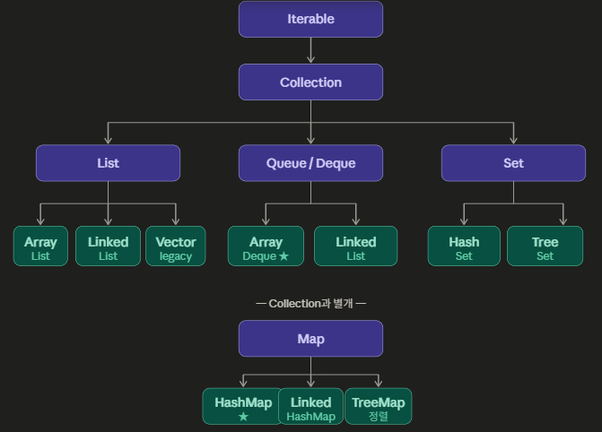

# Java 인터페이스 vs 구현체

## 1. 인터페이스란?

"이런 기능을 제공해야 한다"는 **규격서 / 계약서**이다.  
실제 동작은 없고 메서드 목록만 정의한다.

```java
interface List {
    void add(Object o);   // 선언만 있고
    Object get(int i);    // 구현은 없음
}
```

---

## 2. 구현체란?

그 규격서를 받아서 **실제로 동작을 구현**한 클래스이다.

```java
class ArrayList implements List {
    void add(Object o) { /* 배열로 구현 */ }
    Object get(int i)  { /* 배열 인덱스로 접근 */ }
}

class LinkedList implements List {
    void add(Object o) { /* 노드로 구현 */ }
    Object get(int i)  { /* 노드 순회로 접근 */ }
}
```

---

## 3. 핵심 비유

> **인터페이스** = 충전기 규격 (5V, USB-C)  
> **구현체** = 삼성 충전기, 애플 충전기, 앤커 충전기

규격만 맞으면 어떤 충전기든 꽂아서 쓸 수 있듯이,  
인터페이스만 맞으면 구현체를 자유롭게 바꿔 끼울 수 있다.

---

## 4. 장단점 비교

| 구분 | 인터페이스 | 구현체 |
|------|-----------|--------|
| 역할 | 규격 정의 | 실제 동작 |
| 유연성 | 높음 (갈아끼우기 쉬움) | 낮음 (특정 구현에 종속) |
| 직접 사용 | 불가 (new 못함) | 가능 |

```java
// 인터페이스는 직접 생성 불가
List list = new List();       // ❌ 컴파일 에러

// 구현체로 생성, 인터페이스로 선언
List list = new ArrayList();  // ✅
```

---

## 5. 인터페이스로 선언해야 하는 이유

```java
// 인터페이스로 선언
List<Integer> list = new ArrayList<>();

// 나중에 성능 문제로 바꿔야 할 때 → 이 한 줄만 수정하면 끝!
List<Integer> list = new LinkedList<>();
```

만약 `ArrayList`로 선언했다면 해당 변수를 쓰는 **모든 코드**를 다 바꿔야 한다.  
프로젝트가 커질수록 이 차이가 엄청나게 커진다.

이것이 바로 **"인터페이스에 의존하라"** 는 객체지향 원칙(SOLID의 D, 의존역전 원칙)의 핵심이다.

---

## 6. Collection 계층 구조

```
Iterable
   └── Collection
         ├── List
         │     ├── ArrayList   ← 배열 기반, 일반적으로 권장 ★
         │     └── LinkedList  ← 노드 기반
         ├── Queue / Deque
         │     ├── ArrayDeque  ← 배열 기반, 권장 ★
         │     └── LinkedList  ← 노드 기반
         └── Set
               ├── HashSet
               └── TreeSet     ← 정렬 유지

Map  ← Collection과 완전히 별개의 독립 인터페이스
   ├── HashMap        ← 일반적으로 권장 ★
   ├── LinkedHashMap  ← 삽입 순서 유지
   └── TreeMap        ← 키 정렬 유지
```

> `Map`은 key-value 쌍을 다루기 때문에 `Collection` 계층과 별개로 존재한다.

---

## 7. 권장 선언 패턴 정리

```java
// List
List<Integer> list = new ArrayList<>();

// Queue / Deque
Queue<Integer> q    = new ArrayDeque<>();
Deque<Integer> deq  = new ArrayDeque<>();

// Set
Set<Integer> set = new HashSet<>();

// Map
Map<String, Integer> map = new HashMap<>();
```
