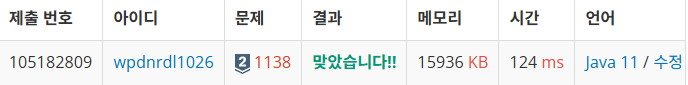

https://www.acmicpc.net/problem/1138

**접근**
> 주어진 좌측에 자신보다 몇명이나 큰 사람이 있는지의 수를 기반으로 오름차순 정렬을 한다.
결과를 저장할 배열에 해당 우선순위 대로 집어넣는데 배열의 각 원소와 비교하며 자기 보다 큰 사람이 나올 때 마다 누적한 cnt(지금까지 오면서 본 나보다 큰 사람의 수)를 보는데 이 cnt가 우선순위와 같다면 해당 인덱스에 집어넣고 아니면 cnt를 누적하며 다음 사람들을 본다.

**문제해결**
```
> 총 인원 N과 나보다 큰 사람의 수를 저장할 height List를 배열타입으로 선언한다.
> 배열 안에 해당 사람의 인덱스 번호와, 왼쪽에 있는 더 큰 사람의 수를 쌍으로 저장하기 위해서이다.
> 최종 결과를 저장할 rst배열도 선언해주고 입력을 처리한다.
> height에 인덱스, 왼쪽에있는 큰사람 수를 쌍으로 받고 이를 큰 사람 수 기준 오름차순 정렬한다.
> 이제 반복문으로 모든 사람에 대해 돌면서 나보다 큰 사람의 수를 누적할 cnt와 반복문을 깨줄 flag를 선언한다.
> 현재 따져줄 사람의 정보, 인덱스와 왼쪽에 있는 큰 수를 cur 배열에 잡아와 준다.
> rst배열을 돌며 순서가 파악되어 줄을 세워둔 사람과 비교한다.
> 각 번째의 사람과 비교하며 cur보다 크면 일단 누적된 cnt를 본다.
> 누적된 cnt가 cur이 가진 왼쪽에 있는 더 큰 사람의 수와 같다면 해당 위치에 cur을 넣어주면서 반복문을 깨준다.
> 아니라면 cnt를 누적하고 자신이 들어갈 위치를 탐색한다.
> flag는 앞선 과정에서 자신의 순서가 정해지지 않은, 즉, 줄의 맨 뒤에 들어가야 할 사람을 세워주는 역할을 한다. 
```
**후기**
> 로직을 생각하는데 생각보다 어려웠고, 이를 구현하는데 자꾸 우선순위가 같은 사람들끼리 순서가 잘못되었다.

