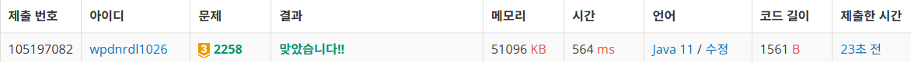

https://www.acmicpc.net/problem/2258

**접근**
> 어떤 비용의 고기를 샀을 때, 그 고기보다 싼 고기들은 묻지도 따지지도 않고 덤으로 준다.
따라서 내가 무게 3에 비용 5짜리를 사면 이 고기보다 싼 (1, 2), (10, 3), (2,4) 등 전부 덤으로 받는다.
하지만 가격이 동일한 고기는 덤으로 받을 수 없다. 따라서 가격이 동일한 고기는 추가 구매를 해야한다.
이에 따라 동일한 비용의 고기가 여러개 있다면 최대한 무게를 많이 받을 수 있는 방법은
동일한 비용의 고기들 중 가장 무게가 많이 나가는 고기를 사는것이다.
예를 들어 고기 종류가 아래처럼 있다고 해보자.
1 2
2 3
4 1
2 5
3 5
5 5
이 때, 비용 5짜리 고기를 산다고하면 각각 1+2+4+2, 1+2+4+3, 1+2+4+5로 동일한 비용인데 9, 10, 12무게의 고기를 얻게 된다.
이제 12짜리 무게로 원한는 M 무게에 도달하지 못했다면 12 5인 상황에서 추가로 2 5나 3 5를 구매해서 무게를 맞춰야한다.
우린 항상 같은 비용일 때, 최고의 선택을 즉, 무게를 가장 크게 해야하므로 동일한 비용의 고기들은 항상 젤 무거운 고기부터 내림차순으로 골라야 최고의 선택이 보장된다.
따라서 12 5에 추가구매 하면 15 10, 17 15가 된다.

**문제해결**
```
> N과 M으로 고기의 수와 원하는 무게를 입력받아준다.
> 최종 구매 비용을 반환할 rst 변수에 초기값으로 Long의 최대값으로 최악의 경우를 준다.
> 고기의 정보와, 각 고기를 샀을 때의 최종으로 가지게 되는 무게, 비용을 저장할 meat, sum List배열을 선언한다.
> 고기의 정보를 입력받고 정렬하는데 기본적으로 비용에 대해 오름차순으로 정렬한다.
> 비용이 같은 고기들은 내림차순으로 정렬해서 동일 비용일 때, 최대의 무게를 가질 수 있도록 해준다.
> 누적합을 사용해 구매한 고기의 정보를 sum에 처리하는데 초기값으로 meat 배열에 첫 인덱스의 고기 정보를 가진다.
> 이 고기는 구매해도 덤으로 받는 고기들이 없으므로 초기값으로 적절하다.
> 그리고 다음 고기의 비용이 같을 때, 덤 없이 추가 비용을 지불하므로 이를 위해 prev로 직전 고기의 비용을 잡아두고 비교한다.
> 반복으로 모든 고기를 돌며보는데 top에 가장 최근 누적합, 직전까지의 고기들의 무게의 합과 비용을 가져온다.
> cur로 현재 고기의 무게와 비용 정보를 가져온다.
> 이제 가져온cur이 prev에 있는 고기의 비용과 다르면 직전의 sum을 덤으로 받을 수 있기 때문에 sum의 무게에 현재 고기의 무게를 더해주고, 비용은 현재 고기의 비용으로 처리해 sum에 추가해준다.
> cur과 prev가 같다면 동일 비용고기이므로 직전까지의 sum을 덤으로 받을 수 없기 때문에 무게를 누적하고 비용도 현재 비용으로 교체가 아닌 누적을 해준다.
> 위 과정이 끝나면 sum에 들어있는 모든 누적합 정보를 보며 원하는 무게 M이상인 sum 정보를 본다.
> 각각의 비용을 rst와 min연산을 통해 목표를 만족하는 경우 중 최소의 비용을 찾는다.
```
**후기**
> 문제가 너무 모호했다고 생각한다. 문제의 토시하나에 따라 처리가 달라졌다고 생각한다. 동일 비용 고기의 처리가 애매해서 고생했다.

