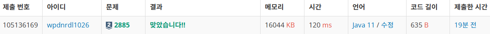

https://www.acmicpc.net/problem/2885

**접근**
> 문제에서 초콜릿의 조각 수가 2의 거듭제곱으로 나오기 때문에 이런 문제는 2진수로 따져 풀 수 있다.
따라서 K가 2의 거듭제곱이면 K조각짜리 한덩이 쓰면 끝나서 K, 0번 출력이고
거듭제곱이 아니라면 2진수로 바꿔서 K의 비트 길이에서 오른쪽에서 부터 1이나올 때까지의 수를 빼주면 총 잘라야하는 수가 된다

**문제해결**
```
> K를 입력받고 구매할 가장 작은 초콜릿을 위해 Integer.githestOneBit로 
K보다 작은 가장 큰 2의 거듭제곱을 저장한다.
> 이 수가 K와 같다면 해당 수인 choco와 0을 출력한다. 쪼개지 않아도 된다는 뜻이다.
> 이제 다르면 cnt에 K의 비트수 - 오른쪽에서 1이나올때까지의 0의 개수를 구한다.
> K의 비트수는 예를들어 9면 1001이라 4를 원하지만 컴퓨터는 그렇지않다.
> nuberOfLeadingZeros를 통해 왼쪽에서 1이 나올 때까지의 0의 개수를 센다.
> 즉 Integer이므로 총 32비트에서 1001이나올 때까지니까 28이된다. 
> 이 값을 Integer.SIZE에서 빼면 4를 얻을 수 있다.
> 이 값에서 이제 오른쪽에서 1이 나올 때까지의 0의 수 numberOfTrailingZeros로 구해준다. 즉, 1001이면 0, 1100이면 2가 나온다.
> 예제의 6을 보면 110 -> 3이고 오른쪽에서 세면 1이므로 3-1로 2가 된다.
> 결과로 choco의 두배를 해준 값과, 위에서 얻어낸 결과를 출력한다.
> choco는 K보다 작은 2의 거듭제곱중 젤 큰값이므로 6이라면 4가 되므로 이 4를 얻기위해 8에서 시작해야한다. 따라서 2를 곱한다.

```
**후기**
> choco를 반복문으로 2를 곱해가면서 찾은 뒤, cnt도 K에서 choco를 뺴고, 2를 나누고, 빼고 나누고 를 반복하며 누적하면서 찾았었다.
하자만 예전에 막대나누기 문제에서 이런 문제는 2진법으로 비트에 접근하면 되는걸 알았기에 자바의 문법에서 비트를 통해 접근하는 방법을 써보았다.