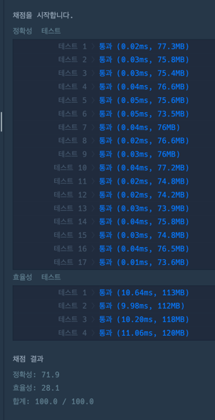
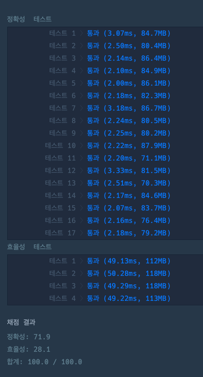

https://school.programmers.co.kr/learn/courses/30/lessons/12906

**접근**
ArrayList안에 배열의 현재값과 이전값을 비교하면서 같지 않으면 넣는 방식

**문제해결**
```
> 1. ArrayList 생성, 중복제거된것들을 담을 배열리스트 생성한다.
> 2. for문을 순회하며 i의 값과 i-1의 값을 비교한다.
>   - 이때, i==0일때는 i-1에 접근하지 않고 그냥 담는다. 
> 3. 메서드의 반환 타입을 List로 변경하고 list를 return 한다. 
```



**후기**
> 몰랐는데 전에 풀던 풀이가 있었다.
> Main1, 이때는 반환값을 제공한 대로 int[]로 반환하려고 stream써서 반환값을 배열로 변경했었다.
