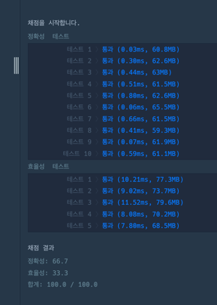

https://school.programmers.co.kr/learn/courses/30/lessons/42584

**접근**
deque에 prices의 인덱스를 하나씩 저장한다.
[1,2,3,2,3] 를 생각하면 
0{가격:1} -> 1{가격:2} -> 2{가격:3} .. 이런식으로 저장된다. 
현재 add하는 index의 가격과 stack의 가장 위에 쌓인 index의 가격을 비교한다.

**문제해결**
+ 정답을 저장할 result 배열
+ 검사를 진행할 deque를 생성
1. prices의 인덱스값을 dq에 1개씩 넣는다.
2. 현재 prices 값이 dq의 최신값보다 작을 경우 --> "update" (dq는 비어있지 않아야함.)
    - 현재 인덱스 - dq의 최신값의 인덱스를 result에 저장한다. (주식이 내려간 정도)
    - 최신값이 update 되기에 계속 검사한다. 
3. 현재 prices 값이 dq의 최신값보다 크거나 같으면 --> dq에 값 저장

**후기**
>test case가 1개 주어져서 그거만 맞게 생각하다가 놓친 부분이 많았다. 
>처음에는 뒤에서부터 min값을 저장하면서 새로운 min값이 나타나면 그 인덱스값을 계산해서 result를 뽑아내려고 했는데, 문제가 있었다.
>[5,4,3,2,1,0]의 경우 min값은 price=1에서 영원히 멈춰버린다. 
>
>두번째 접근은 
>Deque<int[]> dq = new ArrayDeque<>();
>dq안에 [가격,인덱스] 이렇게 넣었다. 가능은 했지만 참조가 불편해짐 이슈..
>
>가격과 인덱스를 매칭해야한다는 생각에 함께 묶어서 저장하려고 했던게 문제였다.
>가격은 이미 배열로 "해당 인덱스"만 저장하면 인덱스값으로 배열에 접근이 가능했다. 쩝.

