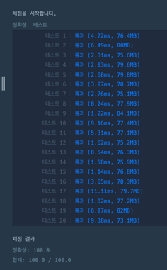

https://school.programmers.co.kr/learn/courses/30/lessons/42587

**접근**
> 일단 몇번째로 출력된건지 알수있게 count변수 선언하기
> queue를 영원히 순회하면서 현재기준으로 max를 찾는다. 
> 저장된 Max와 현재 값을 비교해서 크면 출력, 작으면 다시 넣는다..

**문제해결**
```
> 1. 우선순위와 원래 인덱스의 값을 기억할 queue를 생성한다. (두값을 모두삽입)
> 2. count변수는 최종으로 out된 프로세스의 갯수를 센다 -> 최종적으로 location의 값이 몇번째로 반환되었는지를 설명한다.
> 3. 큐가 빌때까지 while문을 순회한다.
> - cur= [현재우선순위,인덱스]
> - 4. queue의 최댓값을 stream을 통해 구한다.  
> - 5. 현재값이 max라면 그 프로세스가 반환되며 count++
>      - 만약 현재프로세스의 인덱스의 값이 location과 동일하다면 현재 count의 값을 반환한다.
> - 7. max값이아니라면 다시 queue에 넣기
```


**후기**
> 풀때는 별생각없었는데 풀고 나니까 priorityqueue를 구현해버렸다.
> 내 풀이는 while안에 stream으로 max값을 구하느라 n^2..? 
> priorityqueue를 사용하면 while문을 더 깔끔하게 쓸수있을거같다.
> while문을 돌릴때마다 max를 구하는게 효율적이지 않은거같ㅇ,ㅁ/
