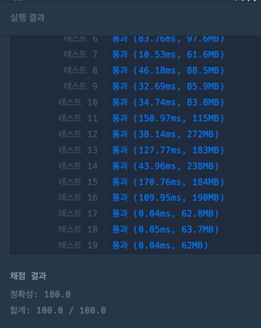

https://school.programmers.co.kr/learn/courses/15009/lessons/121690

**접근**
1. 주어진 hole배열로 탐색경로 그리드를 만든다. grid[][] (구멍있으면 1)
2. bfs 순회한다.
   1. next값을 찾는 2가지 경우
      1. 점프를할 경우
      2. 점프를 하지 않을 경우
   2. 방문유무 visited에 점프유무를 추가한다.
      -> 추가하지 않으면 방문가능한경로 안에서 점프를 실행한다.
      -> 추가하면 점프가 가능한 모든 경로를 탐색한다.
      
**문제해결**

1. 탐색할 그리드를 생성한다.
   1. hole를 순회하며 불가능한 경로의 인덱스를 추출한다.
   2. grid의 해당 인덱스값을 1로 변경한다. => 0과 1로 이루어진 grid생성
2. BFS순회하며 모든 경로 dist값 저장하기
   1. boolean을 3차원으로 생성한다. -> 행과열,점프의 유무를 저장한다.
3. next값을 찾아 queue에 추가한다.
   1. 1칸 점프: dr,dc를 {1,0,-1,0}으로 생성
   2. 2칸 점프: jr,jc를 {2,0,-2,0}으로 생성
      1. 점프했으므로 jump를 1로 변경

**후기**
bfs상태를 잘 생가하자 .
- queue → 현재 탐색할 상태 저장
- visited → 이미 방문한 상태 기록

bfs는 모든것을 탐색한다.  이 문제처럼 경우의수가 늘어나는 경우**, 경로탐색 공간?을 늘릴수있도록 visited를 고려하자.**

- 지금 점프 쓰는 경우
- 나중에 점프 쓰는 경우
- 끝까지 안쓰는 경우

