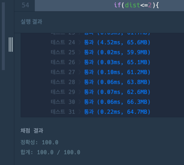

https://school.programmers.co.kr/learn/courses/30/lessons/81302?gad_source=1&gad_campaignid=23716289893&gbraid=0AAAAAC_c4nDledzwSBTKQioGc0r09yJob&gclid=Cj0KCQjw2YDQBhD_ARIsAE1qeSeIoov3sS-9Az6kVTeC66SY9LfkLiPro99pq6MfFBtXhYj3IfNrRSAaAiG8EALw_wcB

**접근**

1. grid가 5개가 존재하며 각 그리드를 bfs 탐색한다.
2. 각 grid의 bfs탐색을 p(응시자의 수)번 실행힌다.
   1. p의 인덱스를 모두 구한 후
   2. p(시작) -> p(도착) 경로로한 bfs탐색 // 실제론 p-1번 검사하겠다.
3. 각 그리드마다 bfs리턴값을 누적해서 조건을 검사한다.

**문제해결**
1. 문자열 배열을 반복문으로 검사하며 -> 숫자 그리드의 형태로 변환한다.
   1. grid[5][5][5] 5개의 5X5 배열생성
   2. 'X'인 경우만 grid값을 1로 변경
   3. 'P'인 경우 저장 (응시자의 인덱스 값을 저장하는 person리스트에)
-> 0과 1로 이루어진 5개의 그리드 배열 생성완료
-> 각 그리드와 대응되는 응시자의 위치를 담고있는 person 리스트 생성완료
2. bfs 탐색을 (5 * (응시자수-1))번 진행한다. 
   1. bfs(start,dest,grid,i) // i번 그리드에서 응시자 start->dest로 가는 탐색
   2. 일반적인 탐색처럼 dist값을 저장한다.
   3. 반환조건
      1. 탐색이 실패한경우 거리두기 성공 -> 0반환
      2. 도착지에 도착
         1. dist가 2보다 작은경우 거리두기 실패 -> 1반환
         2. dist가 2보다 큰경우 거리두기 성공 -> 0반환
   4. 하나의 그리드에서 반환된 값을 누적한 값이 1보다 커지면 최종 거리두기 실패!
   
**후기**

일반적인 문제에서 여러번 반복만 추가된 문제여서 복잡하긴 하지만 직관적으로 풀이했을때
어렵진 않은 문제였다.

