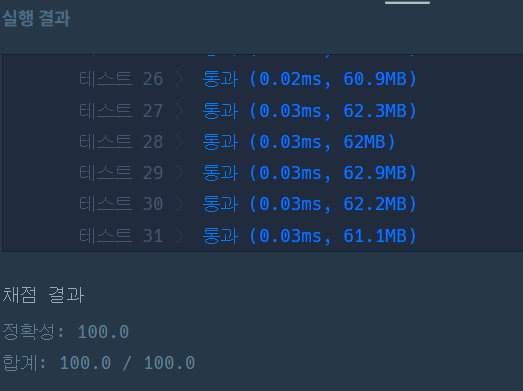

https://school.programmers.co.kr/learn/courses/30/lessons/81302

**접근**
> 맨해튼거리 2에 포함되는 좌표는 주위 인접해있는 8칸에 추가로 상하좌우 2칸 떨어진 위치이다.
> 먼저 1칸떨어진 상하좌우를 보고 P면 false, 파티션이면 기록해둔 뒤 이를 기반으로 2칸을 검사한다.
> 2칸 위치가 P일 때, 해당 사이에 파티션이 없으면 false한다.
> 이제 대각선을 보는데 각 대각선이 필요로 하는 좌표에 파티션이 없다면 false해준다.

**문제해결**
```
> 상, 우, 하, 좌, 우상대각, 우하대각, 좌하대각, 좌상대각 8방으로 방향을 정의한다.
> 일단 4방탐색으로 p를 검사하고 있다면 false 파티션이면 boolean에 이를 기록해둔다.
> x2의 4방탐색을 하며 p면 사이에 앞선 boolean에 기록이 되어있는지 본다. 없으면 false.
> 대각선을 보는데 p가 있다면 해당 좌표가 필요로 하는 boolean에 기록되있나 보고 없으면 false.
> 위 과정을 모든 대기실의 P에 대해서 검사를 해주고 하나라도 false면 해당 대기실에 0, 아니면 1을 저장한다.
```

**후기**
> 다 풀고 다시 고민해보니 너무 복잡하게 풀었다. 
그냥 사방 탐색을 하고 만약 빈 테이블이 있다면 그 테이블에서 다시 4방탐색으로 P가 있는지 보면 된다.

