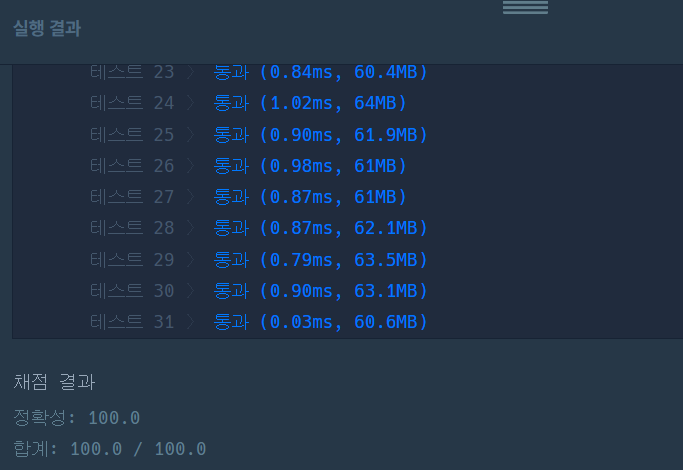

https://school.programmers.co.kr/learn/courses/30/lessons/150365

**접근**
> 주어진 k번만에 가능한 모든 경로를 따지고 그 중 사전순으로 가장 앞에오는 경로를 반환하므로 DFS를 사용한다.
> 방문했던 좌표에 재방문이 가능하므로 방문처리는 해주지 않고 모든 경로를 탐색한다.
> 사전순으로 빠른 순서를 찾기 위해 4방 탐색을 애초에 사전순으로 빠른 순서로 탐색한다.
> 즉, d -> l -> r -> u 순서로 4방탐색을 한다.
> 탐색 자체를 사전순으로 빠른 방향부터 하기 때문에 가장 먼저 도착한 경로가 답이 된다.
> 따라서 도착지에 도착하면 모든 경로를 return해서 끝내 불필요한 연산을 줄인다.

**문제해결**
```
> 주어진 변수들을 전역에서 쓸 수 있도록 먼저 처리해준ㄴ다.
> 재방문이 가능한 DFS이므로 많은 연산이 행해지므로 최대한 경우의 가지치기를 진행해야한다.
> DFS전 미리 시작점 -> 도착점까지의 거리를 구하고 k-dist를 구한다.
> 이때, k-dist는 시작점에서 도착지로 가기위해 필요한 최소의 거리가 된다.
> 이 수는 반드시 짝수여야 가능하다. 따라서 홀수면 impossible을 반환한다.
> 이제 DFS를 들어가기 전 DFS 탐색마다 진행한 방향을 저장하는 char 배열 rst를 선언하고 DFS를 호출한다.
> 사방탐색을 하며 유효한 좌표만 탐색을 하는데 이때 새로 갈 좌표를 검사한다.
> 새로 갈 좌표로 부터 도착지까지의 거리가 K를 넘어가면 불가능한 경로이므로 이 경우는 따지지 않는다.
> 이 검증을 통과하며 최종 이동거리가 K가 되면 현 좌표가 도착좌표인지 확인한다.
> 탐색순서를 이미 사전순으로 했기 때문에 가장먼저 도착한 경로가 답이된다.
> 따라서 도착하면 valid값을 true로 바꿔줘서 다른 모든 탐색중인 경로를 끝내주도록 한다.
> 이제 최종 결과를 출력하는데 "" 면 impossible 아니면 저장된 값을 반환한다.
```

**후기**
> 계속 시간초과가 나서 아무래도 방문처리가 없으니 수많은 경로를 보는 탓에 나는거 같았다.
> 그래서 최대한 가지를 많이 치려고 했고 이를 반영했다. 조금 생각이 어려웠다.

