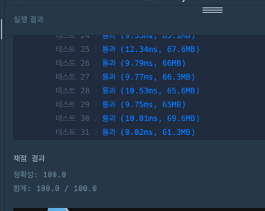

https://school.programmers.co.kr/learn/courses/30/lessons/150365

**접근**
접근1) 전부 탐색후 사전순 정렬
접근2**) d,l,r,u 순서로  이동가능범위인지 확인
이동후남은값 -> 이동가능여부에 대해서 판단한다.

**문제해결**
1. 주어진 거리의 가장 가까운 거리를 측정한다. (dist)
   1. dist가 k보다 크면 불가능
   2. dist가 k보다 작지만 남은거리가 짝수가 아니면 불가능
2. 정답 저장할 문자열 생성
3. 현재위치에서 d->l ->r->u 순서대로가능한지아닌지확인한다.
4. 1부터 k까지 문자열하나씩 찾기위해 k반복
   1. 상하좌우를 탐색한다.
   2. 범위밖이면 나감
   3. 남은값은 k거리 - 이동한거리 - 1
   4. 앞으로 갈거리를 가야할 거리와 비교
      1. 가능하면 문자열에 넣기
      2. 현재위치를 갱ㅇ신한다.

**후기**
처음에 k 이하로 도착해도 되는줄알았다. 
힌트에서 맨해튼 거리로 풀이하는 접근방법을 참고했다. 
dfs,bfs 문제에서 나와서 완전탐색을 생각했는데
거리를 계산하며 그리디로 쉽게풀수있는믄제였다. 

