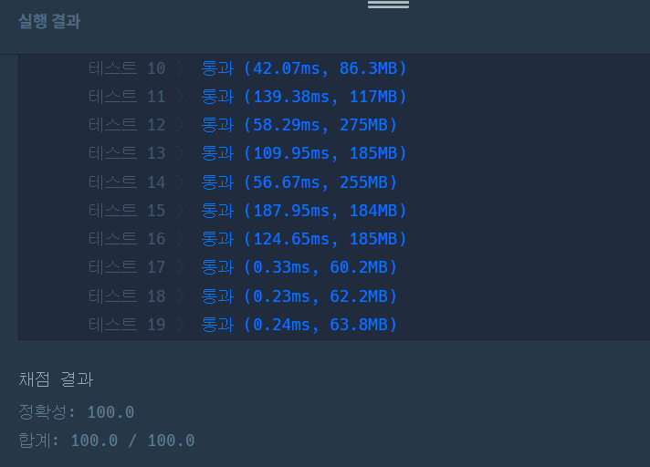

https://school.programmers.co.kr/learn/courses/30/lessons/121690

**접근**
> 방문처리를 3차원으로 주고 세번째 차원을 마법 사용여부를 따져주기 위해 크기2로 주고 0,1로 따진다.
> BFS를 돌며 큐에서 top을 빼왔을 때, 이 값의 broke 상태값인 마법사용 여부를 본다.
> 기본적으로 한칸 이동하는 탐색을 큐에 추가하고 앞선 마법 사용 여부에 따라 마법을 쓴 탐색을 추가로 넣어준다. 
> 이제 두 방문처리로 상태를 관리하며 가장 먼저 도착한 경우의 이동거리를 반환한다.

**문제해결**
```
> 큐에서 행, 열, 마법사용 여부, 이동거리로 4가지 상태를 처리하기 위해 State클래스를 만든다.
> 해당 클래스에서 정수형으로 r,c,rst를 가지고, boolean형으로 broke여부를 가진다.
> 마법 사용여부에 따라 방문처리를 달리하기위해 boolean[][][] 배열을 생성한다.
> 행,열,마법사용여부를 인덱스로 가지며 처리한다.
> 주어진 hole을 기반으로 map을 생성하는데 갈 수 있는곳을 1로 주고 hole 좌표를 0으로 만들어 map을 생성한다.
> BFS를 들어가는데 큐를 State타입으로 주고 초기값으로 시작위치, 아직 마법안썼으니 false, 거리0을 주고 시작한다.
> poll로 큐의 최 상단의 값을 가져오고 사방탬색으로 기본적으로 1칸 이동하는 좌표를 큐에 넣어준다.
> 이때 각 좌표에 대해 방문여부 검사는 poll에서 빼온 broke를 기반으로 해줘야한다.
> 이제 이 broke가 false로 마법을 안썼다면 해당 위치에서 마법을 쓴 경우도 큐에 넣어줘야한다.
> 따라서 이동 거리를 2칸으로 해주고 가능한 좌표를 확인 한 뒤 방문처리를 broke를 true로 바꿔준다.
> 이제 뒤에서 이 true로 바뀐 broke를 기반으로 마법사용조건의 if(!broke)에 걸려 더이상 마법을 못쓰게 된다.
```

**후기**
> 몇번 풀어봤던 유형이라 쉽게 했지만 기본적인 1칸 탐색에서 방문처리의 broke를 잘못 생각해서 시간초과, 메모리초과가 났다. 다시 확실히 알 수 있는 기회였다.

