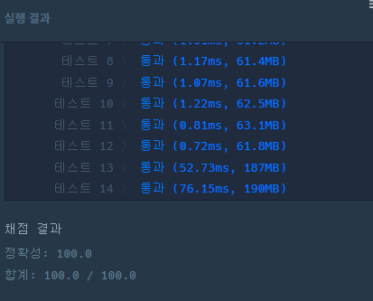

https://school.programmers.co.kr/learn/courses/30/lessons/60063

**접근**
> 드론의 머리, 꼬리가 상관이 없고 평행이동이 가능하고 회전이 가능하다.
> 회전의 조건을 보면 둘 중 한 점을 피벗으로 잡고 회전을 한다. 
> 이 회전 가능여부를 보기 위해서 예를 들어보면 기본적으로 사방탐색으로 상하좌우를 본다고 할 때,
> 기존 좌표가 (1,1), (1,2)에 있다고 할 때, 위로 이동하면 (0,1),(0,2)가 된다.
> 이 좌표를 얻기 위해선 해당 새로운 좌표가 0으로 갈 수 있는지, 봐야한다. 갈 수 있다고 검증된다면 이제 회전을 본다.
> 현 좌표기준 위 두칸이 반드시 비어 있다는 뜻이므로 둘 중 어딜 피벗으로 위로 회전시켜도 가능 하다. 따라서 이 좌표는
> (sr, sc, er, ec) 라고 할 때 새로구한 좌표 (nsr, nsc, ner, nec)에 대해서 (nsr, nsc, sr, sc)와 (ner, nec, er,ec)가 된다.
> 가로 세로 방향을 신경 써주지 않아도 되는 이유는 가로로 되어 있을 때, 좌,우로 이동시키는 좌표와 회전을 처리했을 때의 좌표가 같아서 상관이 없다.
> 따라서 가로일땐 세로로 회전하는것, 세로 일 땐, 가로로 회전되는것 만 유효한 좌표를 얻어내진다.

**문제해결**
```
> 주어진 board를 전역으로 쓰기위해 처리해주고, 인덱스를 위해 크기 n을 잡아준다.
> 로봇의 4개의 좌표에 대해 방문처리를 하기위해 4차원으로 준다.
> 이제 BFS에 로봇의 첫 좌표를 넣어 호출한다. 문제는 1-based지만 board는 0-based인점 유의한다.
> BFS에서 큐는 정수형 배열타입을 가지고 값으로 로봇의 네 좌표와 이동거리값을 가진다.
> 드론의 머리와 꼬리는 상관이 없기 때문에 방문처리에 (0,0,0,1)과(0,1,0,0)은 같은 좌표를 말해서 항상 둘다 처리한다.
> 이제 큐가 빌 때까지 반복하며 큐의 최상단 값을 꺼내 sr,sc,er,ec로 잡아준다.
> 문제의 완수 조건으로 로봇의 한 좌표라도 n,n에 닿으면을 sr,sc가 닿거나 er,ec가 닿는다면으로 처리해준다.
> 이제 사방탐색을 하며 새로 구한 네 좌표를 유효한 범위내에 있는지 검사하고, 벽이 없는지 본다.
> 위 조건이 모두 참이되면 회전을 할 수 있으므로 회전했을 때의 좌표를 방문검사하고 큐에 넣어준다.
> 회전과 평행이동 모두 방문처리는 모두 두가지씩 해준다.(앞 뒤 상관없다고 했으므로)
```

**후기**
> 회전의 처리를 어떻게 인덱스를 잡고 가로,세로를 어떻게 처리할지 고민을 정말 많이헀다.
> 좌표에 두 점을 잡아놓고 기본적인 사방탐색의 과정만 따라가다 보니 기본 사방탐색이 가능할 조건과 회전의 조건이 같다는걸 알았다.
> 이 조건을 적용해 회전을 해보니 회전 했을 때의 좌표도 사방탐색시 변화시켜주는 값과도 같았다.
> 또 가로 세로를 신경 쓰지 않아도 회전을 했을 때의 좌표를 구해보면 각각 가로는 세로만, 세로는 가로만 회전이 구해진다.

