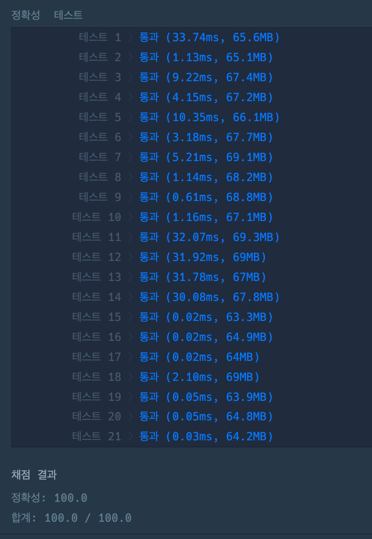

https://school.programmers.co.kr/learn/courses/30/lessons/131703

**접근**
백트래킹, 재귀, 완전탐색,,?
1. 일단 행과 열을 뒤집는 순서는 중요하지 않다.
2. 완전탐색?으로 다 뒤집어보고 그 중에 최소값을 추출하는 방식으로 했다.
3. 행과 열을 flatmap처럼 펼쳐서 -> 5열+5행 => 10번 뒤집기 가능이라고 생각했다. 
=> 따라서, f(10)을 호출하며 각 호출에서 (뒤집기,안뒤집기)를 선택한다. 
=> f(1)까지 진행하고 원하는값이 아니라면 백트래킹을한다.

**문제해결**
1. dfs 호출한다. (총 줄의 갯수, 시작배열, 타겟배열, 현재뒤집기횟수)
   1. base case
      1. begin값이 target과 모든값이 동일할때 : 최소 count를 갱신한다.
      2. n==0일때 다르면 return하고 ->백트래킹
   2. 뒤집기 먼저
      1. turn() -> begin의 n번째줄을 뒤집는 함수
         1. k줄은 행일수도 열일수도있다. -> 행과 열을 분리해서 계산한다. 
         2. 행이라면 -> 0을 1로,1을 0으로
         3. 열이라면 -> 0을 1로,1을 0으로
      2. dfs()호출 -> 이제 n-1을 뒤집으로감, 바뀐 begin, target, 뒤집은횟수++
   3. 원상복구 (백트래킹)
      1. basecase를 만족하지못해 재귀에서 탈출한 녀석들을 원상복구 시킨다.

**후기**
도저히 모든 경우의수를 보는 방법밖에 떠오르지가 않았다.
return식에서 삼항연산자로 깔끔하게 처리하자.
처음에는 turn함수를 사용하지 않고 dfs에 작성했는데, 따로 분리하니까
백트래킹에서도 쓸수 있어서 좋은것같다.
