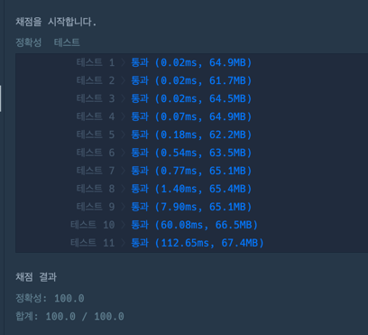

https://school.programmers.co.kr/learn/courses/30/lessons/12952

**접근**

>퀸은 행에 하나씩 배치될 수 잇다.
>퀸1, 퀸2 각각에 의한 경로가 제한된다.

열과행이 n개 존재한다면 
1행에서 퀸1찾고 -> 2행에서 퀸2찾고 -> 3행에서퀸3찾는다....

**문제해결**
1. dfs를 호출한다. -> x는 현재 행: 재귀호출마다 행 ++ 된다.
   2. 해당 행의 1~n 열을 순회하면서 방문되지 않은 칸을 찾는다.
      1. 방문되지 않은 칸으로부터 -> 방문할수없는 칸을 처리한다.
         1. 현재칸의 행, 열과, 대각선을 true처리한다.
   2. basecase
      1. X==n이 될때 하나의 경우의수가 생성된다.
      2. 반복문이 끝날 때.
   

**후기**
백트래킹에서 visited를 boolean으로 했을때 
퀸1 -> 퀸2 -> 퀸3 : 여기서 퀸3에서 퀸2로 돌아갔을때
visited를 false로 해버리면 퀸1으로부터의 경로도 같이 false가 되버렸다.
=> 단순히 false true로 나누면 안되고, 누적기록이 필요하다.
