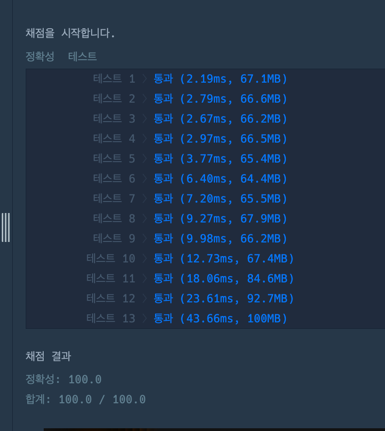

https://school.programmers.co.kr/learn/courses/30/lessons/12946

**접근**
n개의 탑을 옮기는 경우에서 가장 큰 탑을 3으로 옮기기 위해서 나머지 탑을 그대로 2로 옮겨야 한다.
==> 그럼 이제 2에 위치한 n-1의 탑을 3번으로 옮기는 문제로 바뀐다.
마찬가지로 가장 큰탑을 3으로 옮기기 위해 나머지 탑을 1로 옮긴다.
==> 그럼 이제 1에 위치한 n-1의 탑을 3번으로 옮기는 문제로 바뀐다.
....
재귀가 깨지는 조건은 1일때

> n개 문제 = (n-1)개 문제 + 큰 탑 이동 + (n-1)개 문제

**문제해결**
1. 하위재귀호출
    1. n개 중 가장 큰 것을 제외한 n-1을 빈 기둥으로 옮긴다.
    2. 가장 큰것을 3번 기둥으로 옮긴다.
    3. 남은 n-1을 최종목적지로 옮기는 재귀를 호출한다.
2. base 조건
    1. n==1일때 start에 위치한 걸 finish로 옮긴다.

**후기**

