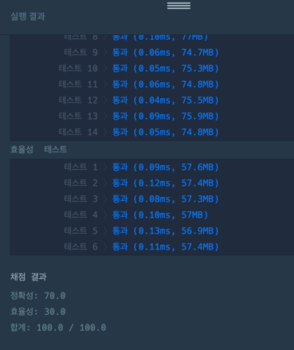

https://school.programmers.co.kr/learn/courses/30/lessons/12902

**접근**
계산후 일반식을 도출해보면 (홀수제외)
0->1 => 1
2->3 => 4-1
4->11 => 12-1 => 4*3 - 1
6->41 => 44-3 => 4*11 -3
4*(이전) - 이전전..?

**문제해결**
1. n이 홀수면 무조건 0을 리턴한다. 
1. 초기 시작 dp[0],dp[2]를 각각 초기화한다. 
2. 순회하며 일반식 dp값을 대입한다.
dp[i]=(4*dp[i-2]-dp[i-4]+1000000007 )% 1000000007;
이때 +100000007을 하는 이유는 4*dp[i-2]-dp[i-4]가 음수가 나오기 때문에
