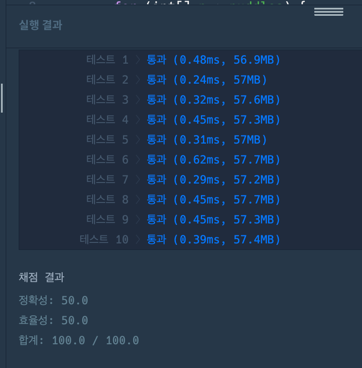

https://school.programmers.co.kr/learn/courses/30/lessons/42898

**접근**
hole인 곳을 제외한다.
dp[i][j]는 
(0,0)에서 (i,j)까지의 최단경로개수

**문제해결**
1. puddles를 순회하면서 hole값을 찾아 true로 만들어놓구
2. 출발지는 언제나 1로 초기화
3. 순회하는데 0행이거나 0열일경우 제외한다. 
4. hole의 값일경우도 제외한다.
5. 해당 위치로 올수있는 경로중
   1. 위쪽에서 오는경우 -> dp갱신
   2. 왼쪽에서 오는경우 -> dp갱신
6. 최종위치에서 dp의 값을 반환한다. 

**후기**
% 1000000007로 나누는이유
-> 100*100문제는 int 최댓값을 벗어난다. 