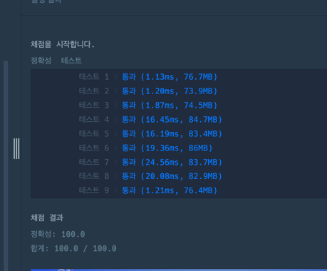
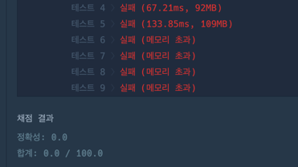
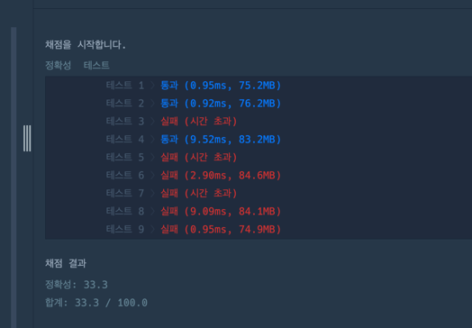

https://school.programmers.co.kr/learn/courses/30/lessons/43238

**접근**
처리시간을 min값과 max값을 정해두고, mid값에 몇명처리가능?
-> 이분탐색을 진행한다. 

**문제해결**
```
1. 탐색범위는 최소:1부터 최대: 가장오래걸리는심사대*n
2. left<= right 동안 반복한다.
    1. mid값은 최대 최소의 중간으로 정의한다. 
    2. mid값을 각 심사대의 시간으로 나눈 몫을 카운팅한다.
    3. 카운팅한 값이 n보다 크다면 -> 더 짧은 시간 가능 -> Mid보다 정답이 작다. 
    4. 카운팅한 값이 n보다 작다면 -> 아직 만족하지 못함. -> mid보다 정답이 큼
3. 최종 최소가능시간인 left를 반환한다. 
```



**후기**

처음에는 각 심사관의 처리 시간을 리스트에 저장한 뒤 정렬해서 해결하려고 했는데, 입력 크기가 커지면 메모리 초과가 발생했다.


최대심사시간*n이 int타입을 벗어나는 값을 가질 수 있기 때문에 Long타입으로 변수를 선언해야했다. 
