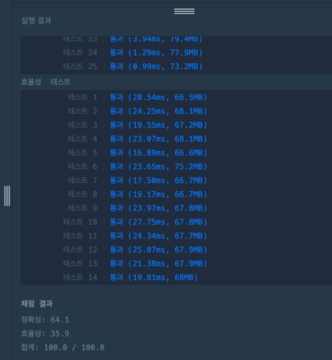

https://school.programmers.co.kr/learn/courses/30/lessons/64062

**접근**
탐색의 범위 -> 몇명이 건널수 있을까?
최솟값 =1, 최대값은 배열의 최댓값으로 -> 이분탐색을 진행한다. 

현재 mid값이 조건을 만족하는지 탐색하는 함수를 따로 만들었다. 
check함수는 -> 현재 징검다리 숫자가 0이 되는 값의 연속된 거리를 찾ㅇ아서
그 거리값이 K보다 작으면 true, 크면 false를 반환한다. 

**문제해결**
```
1. left는 0, right는 배열의 최댓값으로 초기화한다.
2. 반복문
    1. mid는 left와 right의 중간값이다. 
    2. check(mid)함수를 호출한다.
        1.check함수는 stones배열을 순회하면서 stone숫자-(지나간사람수) =0
        (즉, 현재 건널수 없는 징검다리의 수를 카운틴한다.)
        2. 0이 된 징검다리수를 count하는데, 0이 아니라면 count를 다시 0으로 초기화한다. -> 연
        3. 해당 count값이 k보다 크다면 k보다 멀리 점프해야하기 때문에 건널수없다 .-> false반환
        4. 아니라면 true를 반환한다.
    3. 반환된 값이 false라면 -> 건널수 있는 mid보다 작은 범위에서 탐색한다. 
    4. 반환된 값이 true라면 -> mid보다 많은 수가 징검다리를 건널 수 있다. 
3. 최대범위인 right를 최종적으로 반환한다.
```

**후기**
